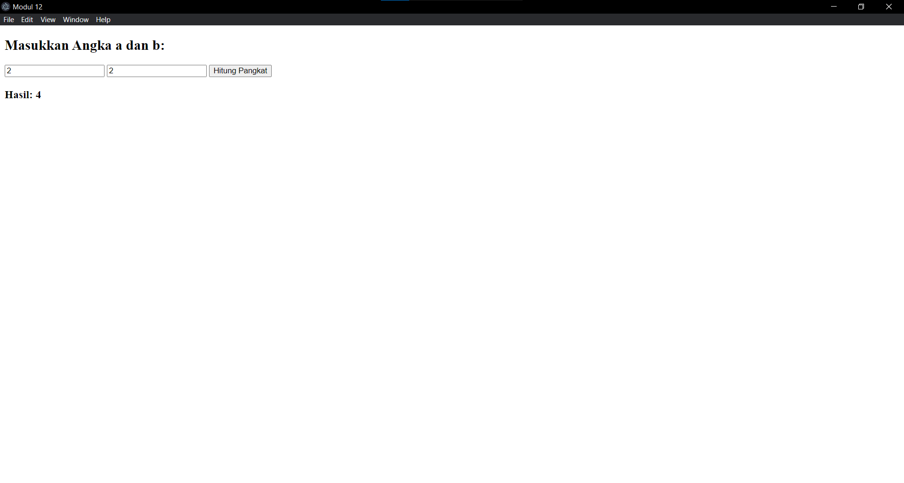

# Tugas Jurnal Modul 12

## Deskripsi Jurnal
<h3>Coder: Aulia Ahmad Ghaus Adzam | 2311104028</h3>

Proyek ini dibuat sebagai jurnal untuk praktikum KPL menggunakan JavaScript. Program ini terdiri dari tiga bagian utama:
1. **Performance Analysis**.
2. **Unit Testing**.
3. **Dan Debugging with Electron**.

---

## Penjelasan Source Code

### package.json
```json
{
    "name": "modul12_231104028",
    "version": "1.0.0",
    "description": "Jurnal Modul 12",
    "main": "main.js",
    "scripts": {
        "start": "electron .",
        "test": "jest"
    },
    "author": "2311104028_AuliaAhmadGhausAdzam",
    "license": "MIT",
    "devDependencies": {
        "electron": "^28.2.3",
        "jest": "^29.0.0"
    }
}

```
<p>di dalam file json ini terdapat config-config utama dari nama, versi, description dari program dan package apa saja yang dipakai disitu kan ada electron . , jest, lalu juga terdapat author nya juga.</p>

---

### main.js
```javascript
const { app, BrowserWindow } = require('electron');
const path = require('path');

function createWindow() {
    const win = new BrowserWindow({
        width: 500,
        height: 350,
        webPreferences: {
        preload: path.join(__dirname, 'renderer.js'),
        nodeIntegration: true,
        contextIsolation: false,
        }
    });

    win.loadFile('index.html');
}

app.whenReady().then(createWindow);
app.on('window-all-closed', () => { if (process.platform !== 'darwin') app.quit(); });
```
<p>File main.js berperan sebagai program utama yang memanggil electron dan terdapat function juga utuk membuat window dan membuat logika apa yang terjadi jika app.on dan ketika window all closed</p>

---

### index.html

```html
<!DOCTYPE html>
<html>
<head>
    <meta charset="UTF-8">
    <title>Modul 12</title>
</head>
<body>
    <h2>Masukkan Angka a dan b:</h2>
    <input type="number" id="inputA" placeholder="a"/>
    <input type="number" id="inputB" placeholder="b"/>
    <button onclick="hitung()">Hitung Pangkat</button>
    <h3>Hasil: <span id="outputLabel">-</span></h3>

    <script src="renderer.js"></script>
</body>
</html>
```
<p>File index.html ini adalah apa yang ditampilkan di electron nanti nya berupa element html input a dan b, button, h3 untuk hasil</p>

---
### renderer.js

```javascript
const { CariNilaiPangkat } = require('./fungsi');

window.hitung = function () {
    const a = parseInt(document.getElementById('inputA').value);
    const b = parseInt(document.getElementById('inputB').value);
    const hasil = CariNilaiPangkat(a, b);
    document.getElementById('outputLabel').textContent = hasil;
}
```
<p>File renderer.js ini berisikan render GUI (tampilan) dan menyimpan variabel input yang memparse ke int dari file html elemen dengan id inputNumber dan mengambil value nya lalu disimpan dalam variabel hasil</p>

---

### fungsi.js

```javascript
function CariNilaiPangkat(a, b) {
    if (b === 0) return 1;
    if (b < 0) return -1;
    if (b > 10 || a > 100) return -2;

    let hasil = 1;
    for (let i = 0; i < b; i++) {
        hasil *= a;
        if (hasil > Number.MAX_SAFE_INTEGER) return -3;
    }

    return hasil;
}

module.exports = { CariNilaiPangkat };
```
<p>File fungsi.js ini berisikan function mencari nilai pangkat</p>

---

### fungsi.test.js

```javascript
const { CariNilaiPangkat } = require('../fungsi');

test('b = 0', () => {
  expect(CariNilaiPangkat(5, 0)).toBe(1);
});

test('b negatif', () => {
    expect(CariNilaiPangkat(5, -2)).toBe(-1);
});

test('b > 10', () => {
    expect(CariNilaiPangkat(5, 11)).toBe(-2);
});

test('a > 100', () => {
    expect(CariNilaiPangkat(101, 2)).toBe(-2);
});

test('hasil > MAX_SAFE_INTEGER', () => {
    expect(CariNilaiPangkat(99999999, 999)).toBe(-3);
});

test('normal case: 2^3', () => {
    expect(CariNilaiPangkat(2, 3)).toBe(8);
});
```
<p>ini juga mirip-mirip sama fungsi.js bedanya ini lebih ke debug dan test case saja</p>

---

## 💻 Output Program
Saat menjalankan program dengan:
```
npm install
npm start
```
Akan menghasilkan output npm start:

```
---

<h1 style ='text-align: center'>Terima Kasih :)</h1>