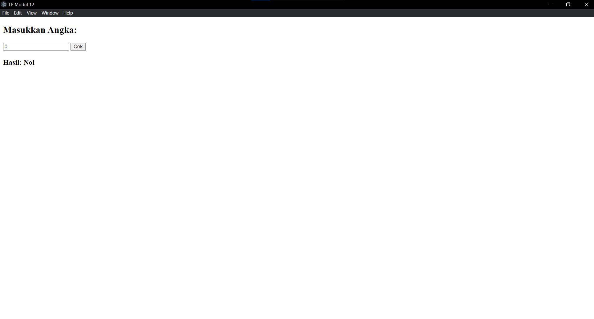

# Tugas Penadahluan Modul 12

## Deskripsi TP
<h3>Coder: Aulia Ahmad Ghaus Adzam | 2311104028</h3>

Proyek ini dibuat sebagai jurnal untuk praktikum KPL menggunakan JavaScript. Program ini terdiri dari tiga bagian utama:
1. **Performance Analysis**.
2. **Unit Testing**.
3. **Dan Debugging with Electron**.

---

## Penjelasan Source Code

### package.json
```json
{
    "name": "tpmodul12_2311104028",
    "version": "1.0.0",
    "description": "Tugas Pendahuluan Modul 12",
    "main": "main.js",
    "scripts": {
        "start": "electron .",
        "test": "jest"
    },
    "author": "2311104028_AuliaAhmadGhausAdzam",
    "license": "MIT",
    "devDependencies": {
        "electron": "^28.2.3",
        "jest": "^29.0.0"
    } 
}
```
<p>di dalam file json ini terdapat config-config utama dari nama, versi, description dari program dan package apa saja yang dipakai disitu kan ada electron . , jest, lalu juga terdapat author nya juga.</p>

---

### main.js
```javascript
const { app, BrowserWindow } = require('electron');
const path = require('path');

function createWindow() {
    const win = new BrowserWindow({
        width: 400,
        height: 300,
        webPreferences: {
            preload: path.join(__dirname, 'renderer.js'),
            nodeIntegration: true,
            contextIsolation: false,
        }
    });

    win.loadFile('index.html');
}

app.whenReady().then(() => {
    createWindow();

    app.on('activate', function () {
        if (BrowserWindow.getAllWindows().length === 0) createWindow();
    });
});

app.on('window-all-closed', function () {
    if (process.platform !== 'darwin') app.quit();
});
```
<p>File main.js berperan sebagai program utama yang memanggil electron dan terdapat function juga utuk membuat window dan membuat logika apa yang terjadi jika app.on dan ketika window all closed</p>

---

### index.html

```html
<!DOCTYPE html>
<html>
<head>
    <meta charset="UTF-8">
    <title>TP Modul 12</title>
</head>
<body>
    <h2>Masukkan Angka:</h2>
    <input type="number" id="inputNumber" />
    <button onclick="cekTanda()">Cek</button>
    <h3>Hasil: <span id="outputLabel">-</span></h3>

    <script src="renderer.js"></script>
</body>
</html>
```
<p>File index.html ini adalah apa yang ditampilkan di electron nanti nya berupa element html input, button, h3 untuk hasil</p>

---
### renderer.js

```javascript
const { CariTandaBilangan } = require('./fungsi');

window.cekTanda = function () {
    const input = parseInt(document.getElementById('inputNumber').value);
    const hasil = CariTandaBilangan(input);
    document.getElementById('outputLabel').textContent = hasil;
}
```
<p>File renderer.js ini berisikan render GUI (tampilan) dan menyimpan variabel input yang memparse ke int dari file html elemen dengan id inputNumber dan mengambil value nya lalu disimpan dalam variabel hasil</p>

---

### fungsi.js

```javascript
function CariTandaBilangan(a) {
    if (a < 0) return 'Negatif';
    if (a > 0) return 'Positif';
    return 'Nol';
}

module.exports = { CariTandaBilangan };
```
<p>File fungsi.js ini berisikan function mencari tanda bilangan jika bilangan diatas 0 maka positif kalo dibawah 0 maka negatif jika 0 maka Nol</p>

---

### fungsi.test.js

```javascript
const { CariTandaBilangan } = require('../fungsi');

test('bilangan negatif', () => {
    expect(CariTandaBilangan(-5)).toBe('Negatif');
});

test('bilangan positif', () => {
    expect(CariTandaBilangan(10)).toBe('Positif');
});

test('bilangan nol', () => {
    expect(CariTandaBilangan(0)).toBe('Nol');
});
```
<p>ini juga mirip-mirip sama fungsi.js bedanya ini lebih ke debug dan test case saja</p>

---

## 💻 Output Program
Saat menjalankan program dengan:
```
npm install
npm start
```
Akan menghasilkan output npm start:



```
-- npm run test --
> tpmodul12_2311104028@1.0.0 test
> jest

 PASS  test/fungsi.test.js
  √ bilangan negatif (4 ms)
  √ bilangan positif (1 ms)
  √ bilangan nol (1 ms)

Test Suites: 1 passed, 1 total
Tests:       3 passed, 3 total
Snapshots:   0 total
Time:        0.739 s, estimated 2 s
Ran all test suites.
```
---

<h1 style ='text-align: center'>Terima Kasih :)</h1>